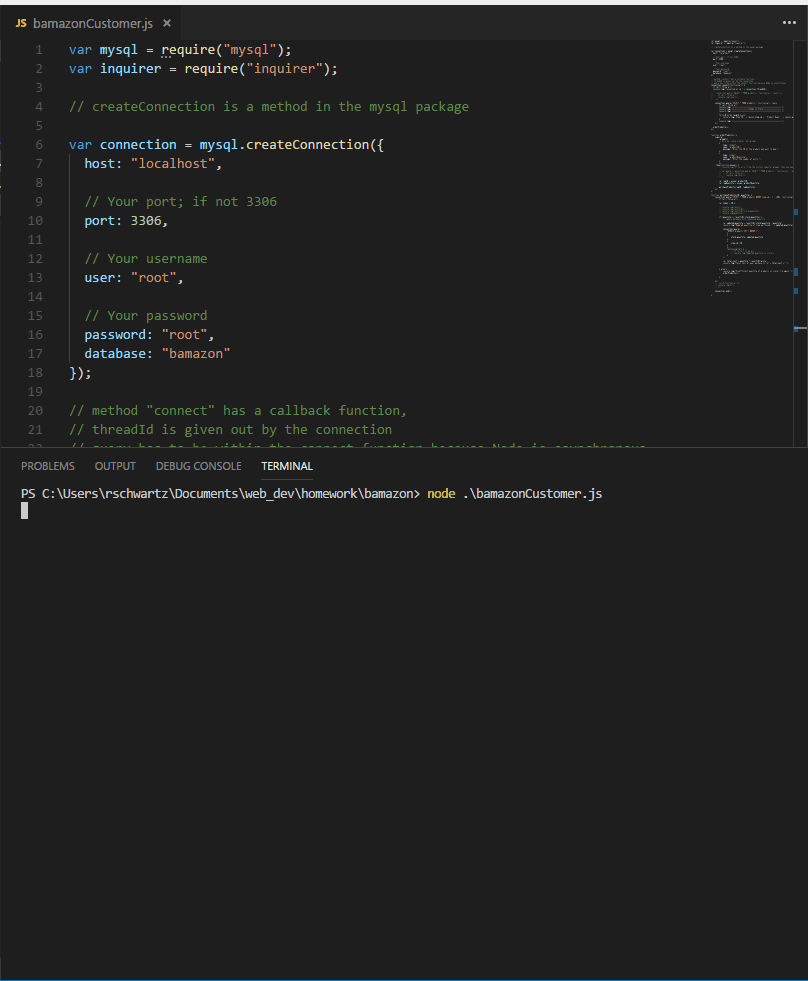

# BAM-azon

* This application provides an Amazon-like interface for users to purchase items from a store inventory.  This server-side program maintains a database that includes an inventory of products.  For each product, the product database tracks the product ID, product name, department name, unit price, and stock quantity.  The program provides a control line interface (CLI) for user interaction.

* In a customer mode, the program's CLI allows a customer to purchase one or more items from inventory.  The application initially displays a list of products available for purchase.  The CLI then prompts the customer to select the desired product ID and product quantity for purchase.  Upon entry, the program updates the product quantity in the database and reports the total purchase cost to the customer.   

## Command Line, Display, and Writing of Data:

